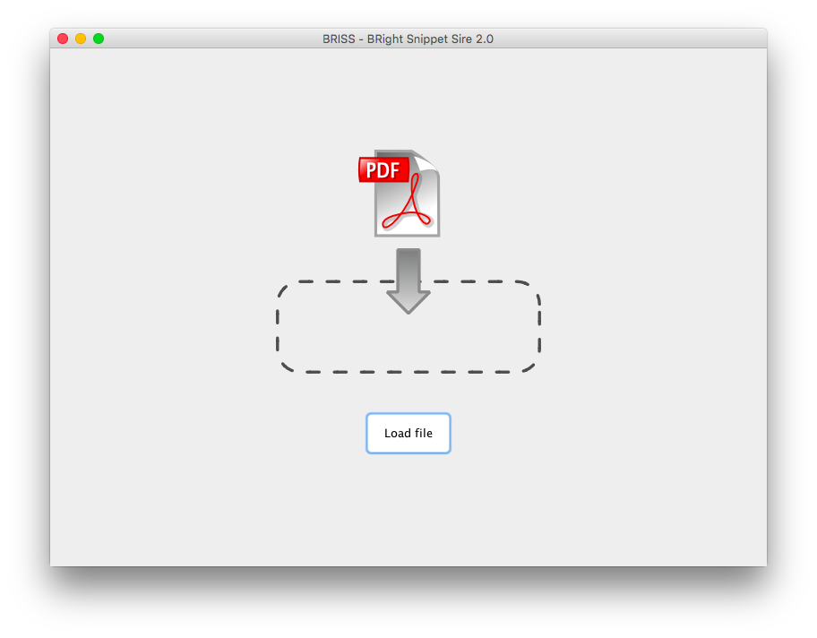

# Briss 2.0

Briss 2.0 is intended to be a GUI Update for the Briss PDF cropping tool.

Briss 2.0 is based on Briss 0.9 which is located at sourceforge: http://sourceforge.net/projects/briss/

### Things that are done by now
- Small refinements on gui which improve the workflow
- Better file chooser than provided by swing
- Added support for drag and drop

### Images

Startscreen with drag and drop support:

Cropping view:


## Build instructions

To build, run the following command:

```
./gradlew distZip
```

You can find the built version in build/distributions

# Briss 0.9 Notes

## BRISS - BRight Snippet Sire 

This is a small application to crop PDF files. It helps the user to decide what 
should be cropped by creating a overlay of similar pages (=>all pages within a pdf
 having the same size, orientation(even/odd)). 


## General
 * Homepage : http://sourceforge.net/projects/briss/
 * License: GPLv3
 * Author: Gerhard Aigner (gerhard.aigner@gmail.com
 * Requirements: Java 6
 * Operating systems: Windows, Linux, MacOSX
 * This software uses two libraries to render and crop PDF files: 
  * itext (AGPLv3) http://itextpdf.com/ 
  * jpedal (LGPL) http://www.jpedal.org/


## Starting the application
You can run the application by executing following command in terminal:

```
.\bin\Briss-2.0.bat
```
or
```
.\bin\Briss-2.0.bat cropthis.pdf
```

(The second line comes in handy if you want shortlinks for pdf editing) 


## Commandline

If you prefer command line and trust the basic automatic detection algorithm
use it this way (can be batched!):

```
.\bin\Briss-2.0.bat -s [SOURCEFILE] [-d [DESTINATIONFILE]]
```
Example:
```
.\bin\Briss-2.0.bat -s dogeatdog.pdf -d dogcrop.pdf
.\bin\Briss-2.0.bat -s dogeatdog.pdf
```
the second line will create the cropped pdf into dogeatdog_cropped.pdf


## Instructions
1. Load a pdf by pressing "Load"
2. Create multiple crop rectangles for all page cluster: Each crop rectangle will
   result in a cropped page.
  1. Press the left mouse button on a corner where you want to start
  2. Draw the rectangle
  3. Release the mouse button
 * [OPTIONAL] Drag around crop rectangles (press and hold mouse button down)   
 * [OPTIONAL] Set width/height to maximum: Select the crop rectangles by holding
    down CTRL + left click into rectangle to select. All crop rectangles will be
    resized to the biggest one, either on width or height.
3) Start the cropping by pressing "Crop" or preview and specify the destination of the cropped pdf.

[OPTIONAL FEATURES]
* Select a Rectangle with ctrl + mouse click. Then copy (ctrl-c) and paste it into another cluster.
* Use hotcorners to make a crop rectangle smaller or bigger

# Dev instructions

Run the application with the following command:

```
./gradlew run
```
